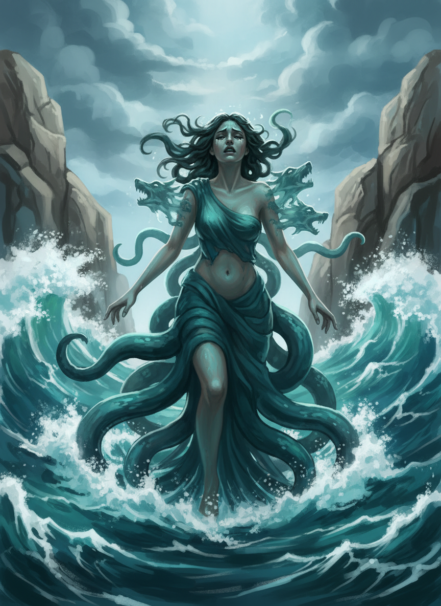
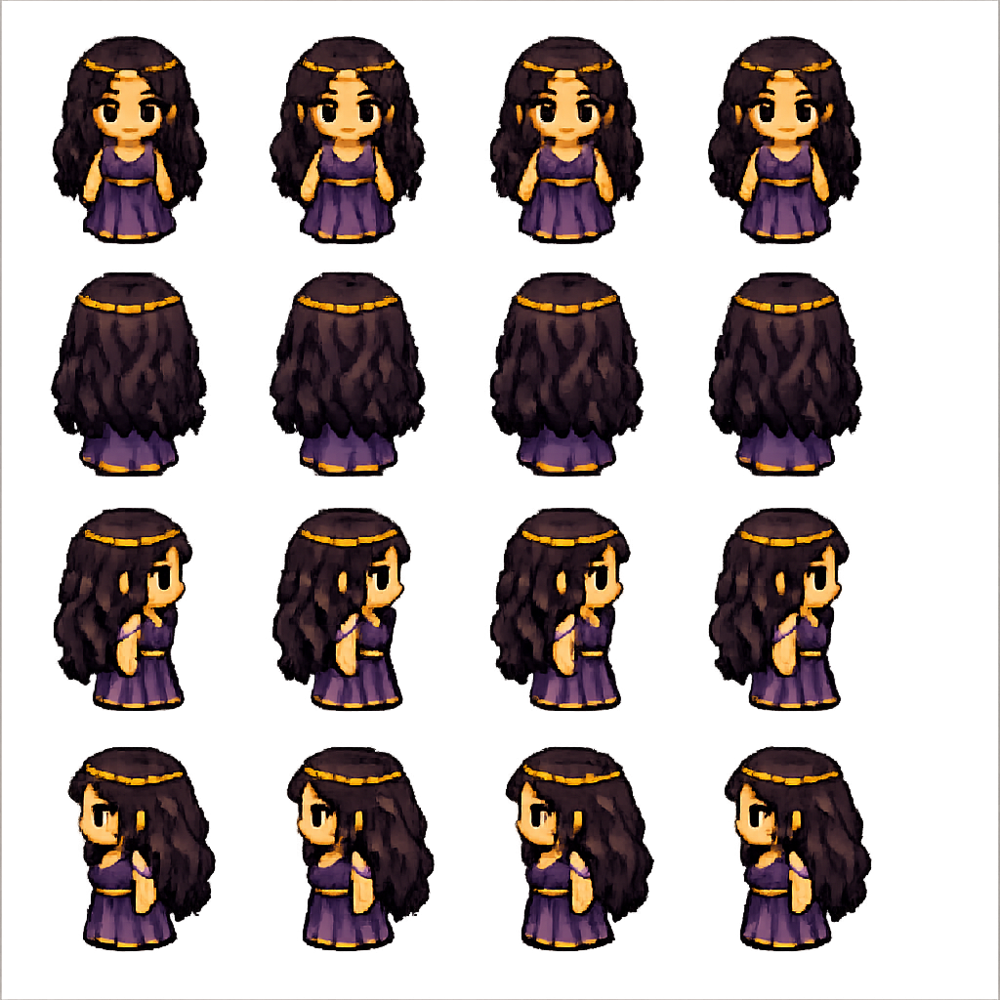
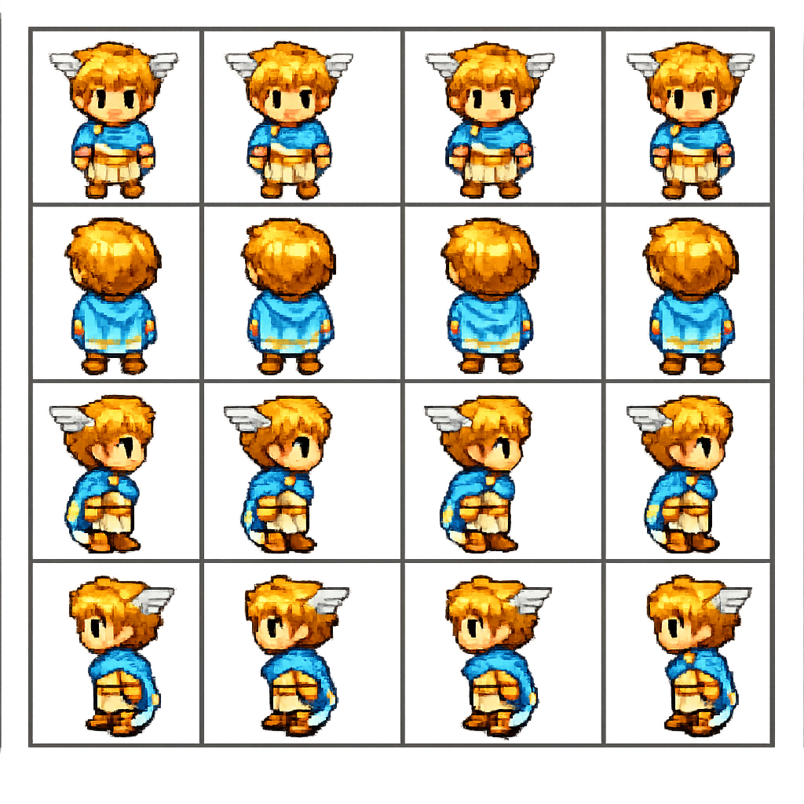
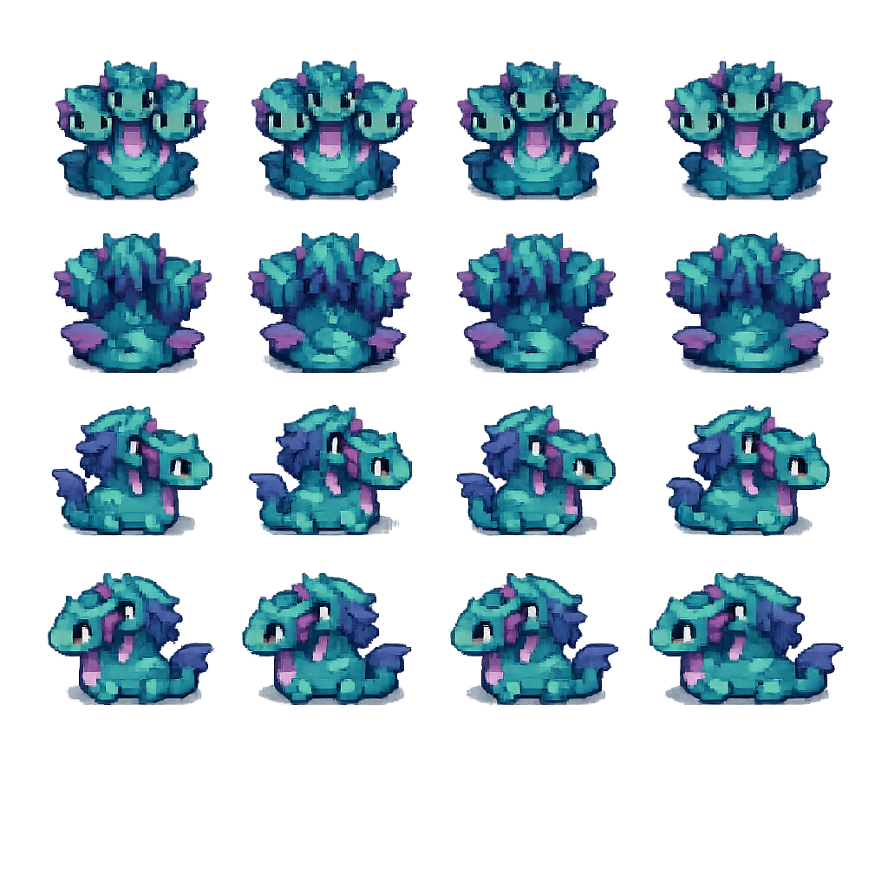

# Circe's Garden

<p align="center">
  
</p>

<p align="center">
  <em>A narrative farming game based on Madeline Miller's <strong>Circe</strong>, built as a solo project using AI-assisted development.</em>
</p>

<p align="center">
  <strong>Godot 4.5</strong> &nbsp;|&nbsp; <strong>GDScript</strong> &nbsp;|&nbsp; <strong>Android Handheld</strong> &nbsp;|&nbsp; <strong>~30 min playtime</strong>
</p>

---

## The Game

Circe, the witch-goddess, lives in exile on the island of Aiaia. She cannot undo her greatest mistake: transforming Scylla into a monster out of jealousy. She tries anyway. The potion fails. She finds peace.

**Core loop:** Farm herbs &rarr; Craft potion &rarr; Sail to Scylla &rarr; Potion fails &rarr; Acceptance

**Target device:** [Retroid Pocket Classic](https://www.goretroid.com/) (3.92" portrait AMOLED, D-pad input, Android 14) &mdash; a handheld gaming device designed for retro and indie games.

---

## Visual Showcase

### Prologue Cutscenes

The game opens with a narrated prologue telling Scylla's story through seven painted illustrations. Each fills the full portrait viewport (1080x1240).

<p align="center">
  
  
  
  
</p>

<p align="center"><em>Left to right: Exile on Aiaia &bull; The love triangle &bull; Scylla's transformation &bull; A fragile hope</em></p>

### Character Sprites

Each character has a 4-direction sprite sheet (idle + walk animations) on a 4x4 grid at 64x64 pixels per frame.

<p align="center">
  
  &nbsp;&nbsp;&nbsp;
  
  &nbsp;&nbsp;&nbsp;
  
</p>

<p align="center"><em>Circe (player) &bull; Hermes (guide) &bull; Scylla (tragic monster)</em></p>

### World Assets

<p align="center">
  
  &nbsp;&nbsp;
  
  &nbsp;&nbsp;
  
</p>

<p align="center"><em>Boat travel between islands &bull; Pharmaka crafting table &bull; Moly herb ready for harvest</em></p>

### Tileset

<p align="center">
  
</p>

<p align="center"><em>32x32 tileset for Aiaia &mdash; grass, water, stone, Greek architecture, farm plots</em></p>

---

## How It Was Built &mdash; AI-Assisted Development

This project is a case study in **using AI tools to build something complete as a solo non-technical creator**. Every aspect &mdash; game architecture, visual assets, testing, deployment planning &mdash; was produced through deliberate AI collaboration.

### The Development Pipeline

| Layer | Tool | What It Did |
|-------|------|-------------|
| Game code & architecture | Claude Code (Anthropic) | Wrote all GDScript, designed systems, ran tests |
| Visual asset generation | Custom pipeline via Gemini API | Produced all sprites, tilesets, and cutscene paintings |
| Prompt engineering | Structured spec docs + JSON schemas | Ensured consistency across 40+ generated assets |
| Project management | AI agents + structured docs | Phase-based development with clear milestones |

### Building an Image Generation Pipeline

The biggest challenge wasn't writing code &mdash; it was **getting consistent, high-quality visual assets at scale from AI image generation.**

I created [`ASSET_GENERATION_V3.md`](game/ASSET_GENERATION_V3.md) as a comprehensive spec document that served as the single source of truth for all visual asset production. It includes:

- **Character briefs** with exact palette anchors, proportions, and direction rules
- **A Consistency Lock Protocol** (the FRAME method) to maintain character identity across frames:
  - **F**ocus: same character identity from prior frame
  - **R**adiance: flat consistent lighting
  - **A**ngle: fixed camera angle per direction
  - **M**atter: fixed facial traits, clothing, proportions
  - **E**xtras: only pose/action changes
- **Copy-paste prompt templates** for each asset type (characters, tilesets, cutscenes)
- **A QA checklist** for validating every generated asset

This approach produced **33 required asset files** across characters, props, tilesets, UI icons, and full-screen cutscene paintings &mdash; all with consistent style and identity.

`[PLACEHOLDER: Specific learnings about prompt engineering iterations — what failed, what worked, how many regeneration passes were needed]`

`[PLACEHOLDER: How the FRAME consistency method was developed through trial and error]`

### Transferable Skills: Beyond Game Dev

The same structured approach to AI asset generation applies directly to other domains:

`[PLACEHOLDER: How this pipeline approach applies to marketing and sales asset generation — consistent brand imagery at scale using JSON prompting]`

`[PLACEHOLDER: Examples of applying structured AI prompting to other professional contexts]`

`[PLACEHOLDER: The meta-skill of "directing AI" — maintaining creative vision while delegating production to AI tools]`

### What I Learned

`[PLACEHOLDER: Key meta-skills that transfer beyond gamedev — structured thinking, spec-driven development, quality gates]`

`[PLACEHOLDER: Learnings about using AI agents across multiple tools and platforms (Claude Code, Gemini, Notion agents)]`

`[PLACEHOLDER: How to maintain creative direction while delegating execution to AI — the "creative director" mindset]`

`[PLACEHOLDER: Structured prompting as a general skill — getting consistent, high-quality output at scale from any AI system]`

`[PLACEHOLDER: What surprised you most about this process]`

---

## Quest Progression

| Quest | What Happens | Game Systems Used |
|-------|-------------|-------------------|
| **0 - Prologue** | Flashback: Scylla's transformation, arrival on Aiaia | Cutscene system, narrated screens |
| **1 - Pharmaka** | Meet Hermes, learn herb magic, herb identification minigame | NPC dialogue, minigame |
| **2 - Farming** | Grow moly (the cure herb) in Circe's garden | Farming system, day cycle |
| **3 - Crafting** | Craft the Calming Draught potion | Crafting system, inventory |
| **4 - The Voyage** | Sail to Scylla's cove, administer potion &mdash; it fails | Boat travel, story climax |
| **5 - Acceptance** | Return to Aiaia, find peace with what cannot be changed | Epilogue, credits |

*The ending is book-accurate: the potion fails. Scylla remains a monster. The story is about acceptance, not reversal.*

---

## Technical Highlights

### Architecture

Three autoloads keep things simple:

```
GameState      — Inventory, quest flags, farm state, day cycle
SceneManager   — Scene transitions with crossfade
AudioController — Music and SFX playback
```

### Test-First Development

The project uses a multi-level test suite:

```
tests/
  unit/          — Logic tests (inventory, flags, farming)
  checkpoints/   — Quest milestone verification (Q0-Q5)
  visual/        — Headed screenshot capture for visual QA
```

Tests use dependency injection &mdash; `RefCounted` scripts that accept a `game_state: Node` parameter rather than relying on autoload globals. This makes them runnable in headless mode:

```bash
# Run all logic tests
Godot --headless --script tests/run_all.gd

# Capture visual screenshots
Godot --path . res://tests/visual/test_screenshot.tscn
```

### Portrait-First Design

Everything is designed for a vertical 1080x1240 viewport &mdash; the world map, UI layout, camera zoom, and dialogue positioning are all built for portrait handheld play with D-pad controls.

### Context-Aware NPCs

Characters respond differently based on quest progress. Hermes has unique dialogue for each quest state, teaches mechanics when appropriate, and launches the herb minigame at the right moment. Scylla's encounter plays out the potion failure as a scripted narrative beat.

`[PLACEHOLDER: Other technical insights worth highlighting]`

---

## Project Structure

```
circes-garden/
  project.godot               # Godot project config
  game/
    autoload/                  # GameState, SceneManager, AudioController
    scenes/                    # Main menu, world, prologue, credits, minigame
    entities/
      player/                  # Player character (movement, interaction)
      npcs/                    # Hermes, Scylla, Pig
      interactables/           # Boat, farm plot, crafting table, sleep spot
    ui/                        # Dialogue box, inventory, quest display
    resources/                 # Data classes (dialogue, items, crops)
    Generated_Image_Assets/    # All AI-generated visual assets
    ASSET_GENERATION_V3.md     # The image generation spec (process artifact)
  assets/
    audio/                     # Music tracks + SFX
    sprites/                   # Active game sprites
  tests/
    unit/                      # Headless logic tests
    checkpoints/               # Quest milestone tests
    visual/                    # Screenshot capture tests
```

---

## Status

**~75% complete** &mdash; core gameplay loop is fully functional, all quests playable.

| Phase | Status |
|-------|--------|
| Foundation (menu, world, player, travel) | Done |
| Core gameplay (NPCs, dialogue, farming, crafting, quests) | Done |
| Visual assets (sprites, tilesets, cutscenes) | Done |
| Portrait conversion for handheld | Done |
| Audio integration (music + SFX) | Done |
| Dialogue polish | Done |
| Final polish pass | In Progress |
| Android export + device testing | Planned |

---

## Built With

- **[Godot 4.5](https://godotengine.org/)** &mdash; Open-source game engine
- **[Claude Code](https://claude.ai/)** (Anthropic) &mdash; AI coding assistant
- **Gemini API** (Google) &mdash; AI image generation for visual assets
- **[Madeline Miller's *Circe*](https://madelinemiller.com/circe/)** &mdash; Source material and narrative foundation

---

<p align="center">
  <em>Made with pharmaka and persistence.</em>
</p>
